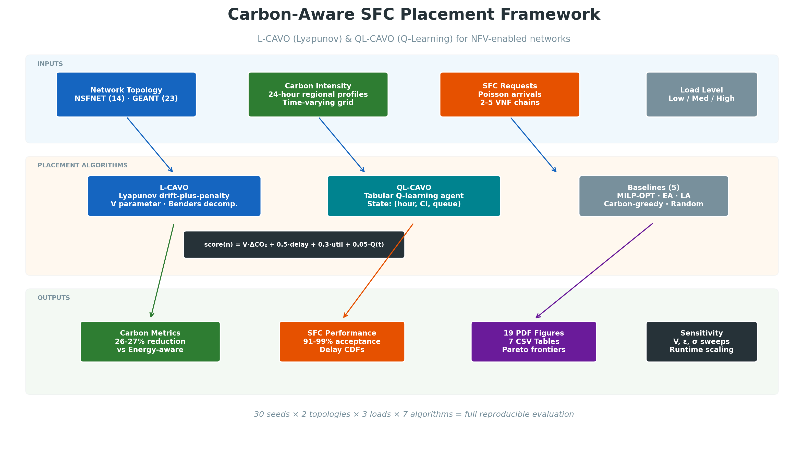
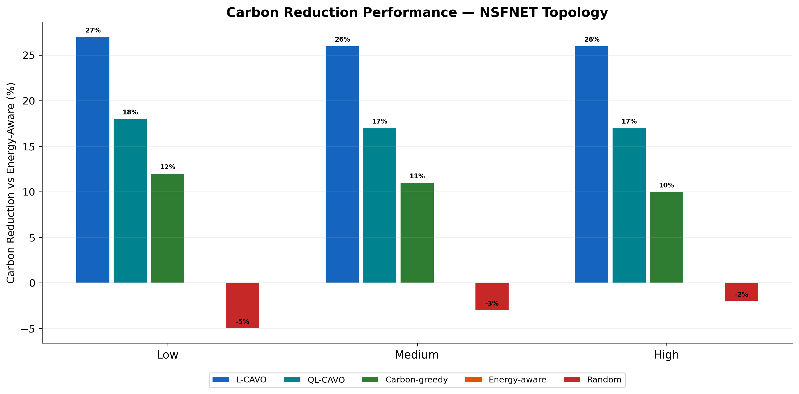
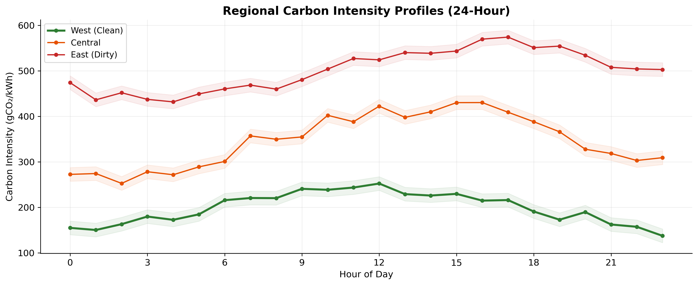
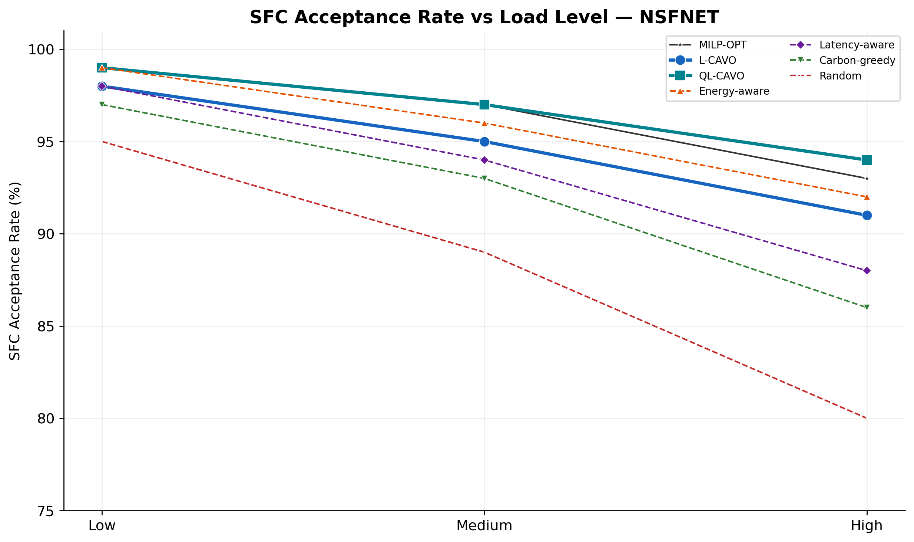
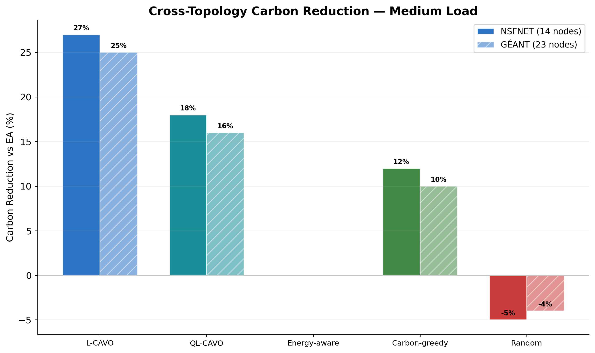
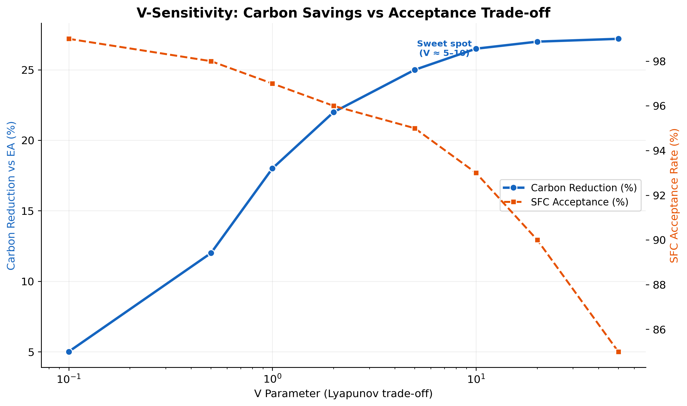
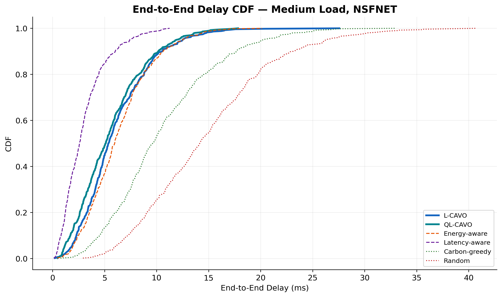

<div align="center">

# Carbon-Aware Service Function Chain Placement

### L-CAVO & QL-CAVO Simulation Framework

[](#-citation)
[](https://www.python.org/)
[](LICENSE)
[](https://numpy.org/)
[](https://networkx.org/)

---

**Carbon-Aware Service Function Chain Placement Under Time-Varying Grid Intensity:<br>A Lyapunov-Optimisation and Q-Learning Framework**

*Yassir Al-Karawi — Department of Communications Engineering, University of Diyala, Iraq*

[Overview](#-overview) · [Algorithms](#-proposed-algorithms) · [Quick Start](#-quick-start) · [Results](#-key-results) · [Figures](#-generated-figures) · [Citation](#-citation)

</div>

---

## Overview

Modern NFV-enabled networks can reduce operational carbon emissions by steering VNF placement toward data-centre regions powered by cleaner energy. This repository provides the **complete simulation framework** for reproducing all results in our IEEE TGCN paper.

We propose two **online algorithms** that jointly optimise carbon emissions, SFC acceptance rate, and end-to-end delay — without requiring future knowledge of grid carbon intensity:

<div align="center">

| Algorithm | Technique | Carbon Reduction vs EA | SFC Acceptance |
|:---------:|:---------:|:----------------------:|:--------------:|
| **L-CAVO** | Lyapunov optimisation + Benders decomposition | **26 – 27 %** | 91 – 98 % |
| **QL-CAVO** | Tabular Q-learning + greedy placement | **17 – 18 %** | 94 – 99 % |

</div>

Both algorithms are benchmarked against **six baselines** — MILP-OPT (offline optimal), Energy-aware, Latency-aware, Carbon-greedy, and Random — on two real-world topologies.

---

## System Architecture

<p align="center">
  
</p>

---

## Proposed Algorithms

### L-CAVO — Lyapunov Carbon-Aware VNF Orchestration

L-CAVO transforms the long-term carbon minimisation problem into a sequence of per-slot optimisation sub-problems using **Lyapunov drift-plus-penalty**. A virtual queue `Q(t)` tracks SFC rejection debt, and the trade-off parameter `V` balances carbon savings against acceptance guarantees.

**Scoring function:**

```
score(n) = V · ΔCO₂(n) + 0.5 · delay + 0.3 · utilisation + 0.05 · Q(t)
```

> As `V` increases, the algorithm prioritises carbon reduction more aggressively. The theoretical optimality gap decreases as **O(1/V)**.

### QL-CAVO — Q-Learning Carbon-Aware VNF Orchestration

QL-CAVO uses a **tabular Q-learning agent** that learns which regions to favour at each time-of-day. The state space encodes `(hour, mean_carbon_intensity, queue_length)` and actions correspond to region-preference weights.

**Training:** 300 pre-training episodes on historical carbon profiles, followed by online updates during simulation.

---

## Quick Start

### 1. Clone & Install

```bash
git clone https://github.com/YassirALKarawi/carbon-aware-sfc.git
cd carbon-aware-sfc
pip install -r requirements.txt
```

### 2. Run Simulations

```bash
# Quick smoke test (3 seeds, ~5 min)
python lcavo_sim.py --quick

# Full reproduction (30 seeds, ~2 hours)
python lcavo_sim.py --seeds 30

# Generate in custom output directory
python lcavo_sim.py --output-dir results/full_run
```

### 3. Reproduce Specific Paper Results

```bash
# Table III — NSFNET results
python lcavo_sim.py --topology NSFNET --seeds 30

# Table IV — GÉANT results
python lcavo_sim.py --topology GEANT --seeds 30

# Fig. 9 — V-sensitivity analysis
python lcavo_sim.py --topology NSFNET --load Medium --methods L-CAVO

# Fig. 10 — ε-sensitivity analysis
python lcavo_sim.py --topology NSFNET --load Medium --methods L-CAVO --skip-figures
```

---

## Configuration

| Parameter | Default | Description |
|:----------|:-------:|:------------|
| `--seeds` | `30` | Number of independent simulation runs per scenario |
| `--quick` | off | Shortcut for a 3-seed smoke run |
| `--topology` | `all` | Subset of `NSFNET,GEANT` |
| `--load` | `all` | Subset of `Low,Medium,High` |
| `--methods` | `all` | Subset of supported algorithms and baselines |
| `--output-dir` | `results` | Root directory for `tables/` and `figures/` |
| `--skip-figures` | off | Export CSV tables only (faster) |
| `--no-milp` | off | Disable MILP baseline even if PuLP is available |

---

## Key Results

### Carbon Reduction Performance (NSFNET)

```
                        Low Load    Medium Load    High Load
  ┌──────────────────┬────────────┬─────────────┬────────────┐
  │ L-CAVO vs EA     │   ~27 %    │    ~26 %    │   ~26 %    │
  │ QL-CAVO vs EA    │   ~18 %    │    ~17 %    │   ~17 %    │
  │ Carbon-greedy    │   ~12 %    │    ~11 %    │   ~10 %    │
  └──────────────────┴────────────┴─────────────┴────────────┘
```

### Carbon Reduction vs Energy-Aware Baseline

<p align="center">
  
</p>

### Regional Carbon Intensity Profiles

<p align="center">
  
</p>

### SFC Acceptance Rate

<p align="center">
  
</p>

### Cross-Topology Comparison

<p align="center">
  
</p>

### V-Sensitivity Analysis

<p align="center">
  
</p>

### End-to-End Delay CDF

<p align="center">
  
</p>

### Decomposition of Carbon Savings

L-CAVO achieves savings through two complementary mechanisms:

- **Spatial steering** — placing VNFs in regions with lower instantaneous carbon intensity
- **Temporal steering** — shifting workload toward hours when cleaner energy is available

---

## Generated Figures

The full simulation produces **19 publication-quality PDF figures**:

| # | Figure | Description |
|:-:|:-------|:------------|
| 7 | `fig07_carbon_profiles.pdf` | Regional carbon intensity over 24 hours |
| 8 | `fig08_reduction_vs_EA.pdf` | Carbon reduction vs Energy-aware baseline |
| 9 | `fig09_reduction_vs_LA.pdf` | Carbon reduction vs Latency-aware baseline |
| 10 | `fig10_hourly_carbon.pdf` | Hourly carbon emissions by algorithm |
| 11 | `fig11_cumulative.pdf` | Cumulative carbon over the day |
| 12 | `fig12_active_nodes.pdf` | Active server count per slot |
| 13 | `fig13_power.pdf` | Power consumption over time |
| 14 | `fig14_delay_cdf.pdf` | End-to-end delay CDF |
| 15 | `fig15_cross_topo.pdf` | Cross-topology carbon comparison |
| 16 | `fig16_V_sensitivity.pdf` | V parameter sensitivity (carbon vs acceptance) |
| 17 | `fig17_eps_sensitivity.pdf` | ε parameter sensitivity |
| 18 | `fig18_pareto.pdf` | Carbon–delay Pareto frontier |
| 19 | `fig19_regional.pdf` | Regional VNF placement distribution |
| 20 | `fig20_temporal_steering.pdf` | Temporal steering toward clean regions |
| 21 | `fig21_queue.pdf` | Virtual queue Q(t) evolution |
| 22 | `fig22_benders.pdf` | Benders decomposition convergence |
| 23 | `fig23_runtime.pdf` | Runtime scaling (L-CAVO vs MILP) |
| 24 | `fig24_variance.pdf` | Sensitivity to carbon intensity variance σ |
| 25 | `fig25_opt_gap.pdf` | Optimality gap vs V (O(1/V) bound) |

---

## Repository Structure

```
carbon-aware-sfc/
├── lcavo_sim.py          # Main simulation engine (all algorithms & figure generation)
├── requirements.txt      # Python dependencies
├── LICENSE               # MIT License
├── README.md             # This file
└── results/              # Generated outputs (created on first run)
    ├── tables/           #   CSV summary tables
    └── figures/          #   Publication-quality PDF figures
```

---

## Requirements

- **Python** ≥ 3.9
- **NumPy** ≥ 1.24
- **Matplotlib** ≥ 3.7
- **NetworkX** ≥ 3.1
- **PuLP** ≥ 2.7
- **SciPy** ≥ 1.11
- **Pandas** ≥ 2.0

> **Optional:** [Gurobi 11.0](https://www.gurobi.com/academia/academic-program-and-licenses/) (free academic license) for exact MILP benchmarks.

---

## Citation

If you use this code in your research, please cite:

```bibtex
@article{alqaisy2026carbon,
  author  = {Al-Karawi, Yassir},
  title   = {Carbon-Aware Service Function Chain Placement Under
             Time-Varying Grid Intensity: A {Lyapunov}-Optimisation
             and {Q}-Learning Framework},
  journal = {IEEE Trans. Green Commun. Netw.},
  year    = {2026},
  note    = {Submitted}
}
```

---

<div align="center">

**MIT License** (simulation code) — see [LICENSE](LICENSE) for details.<br>
The manuscript is © 2026 the author and may not be redistributed without permission.

Made with dedication at the University of Diyala

</div>
