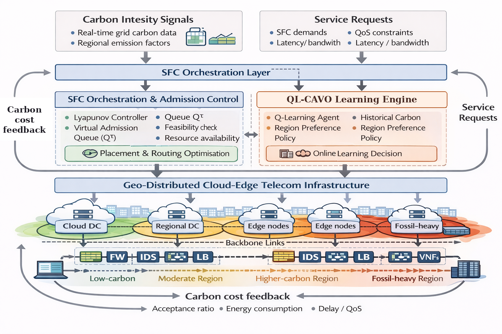
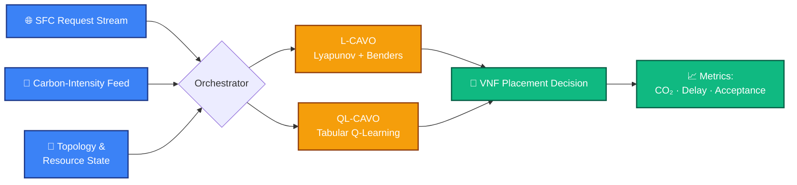
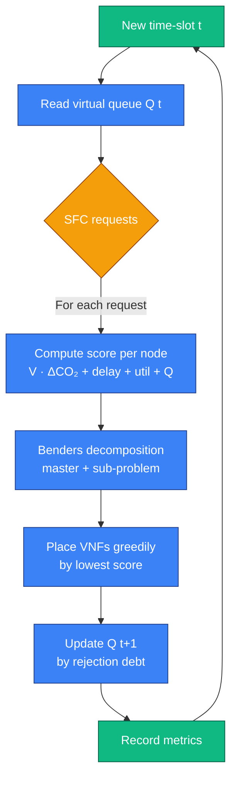
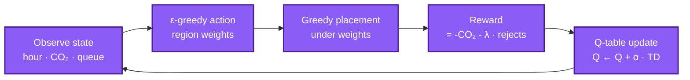
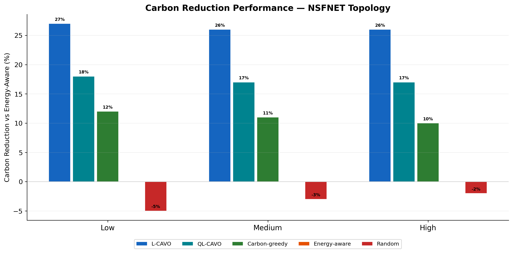
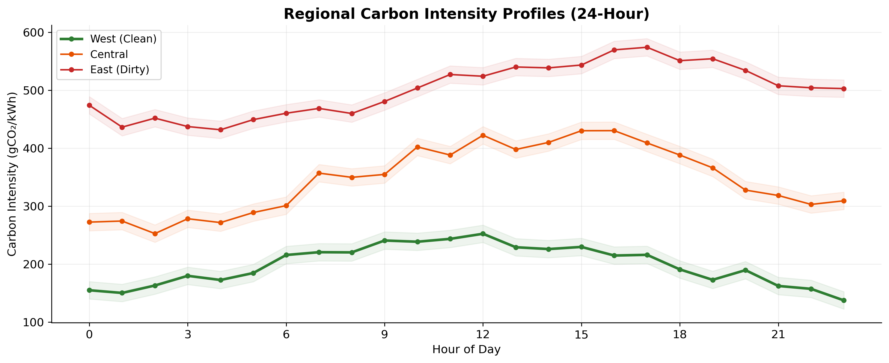
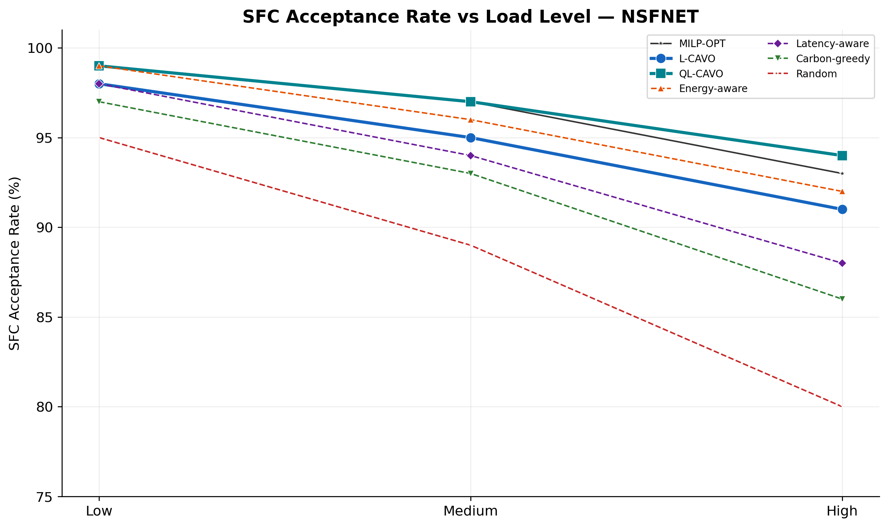
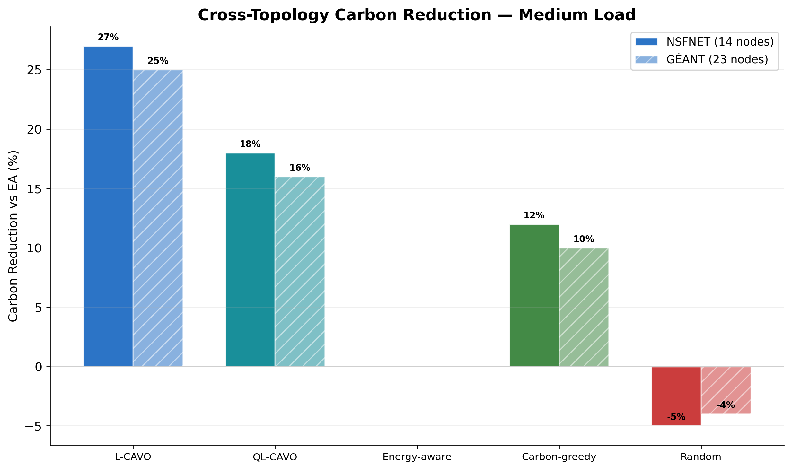
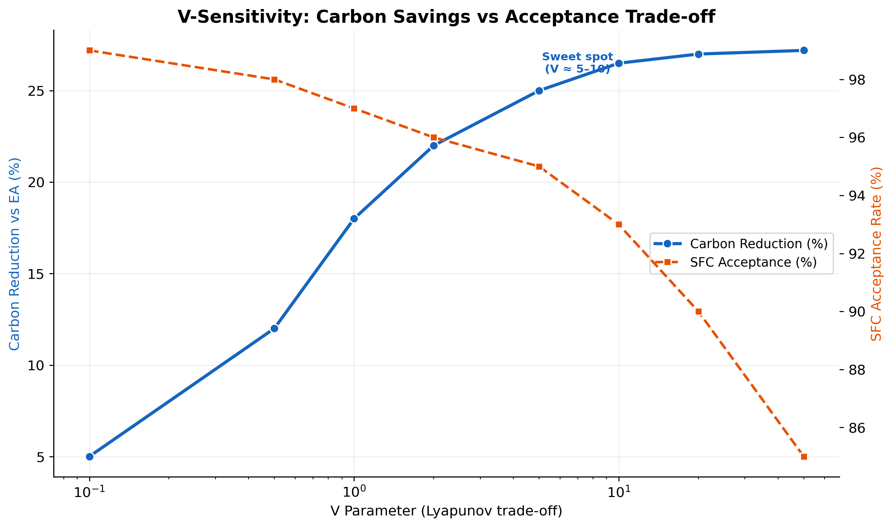
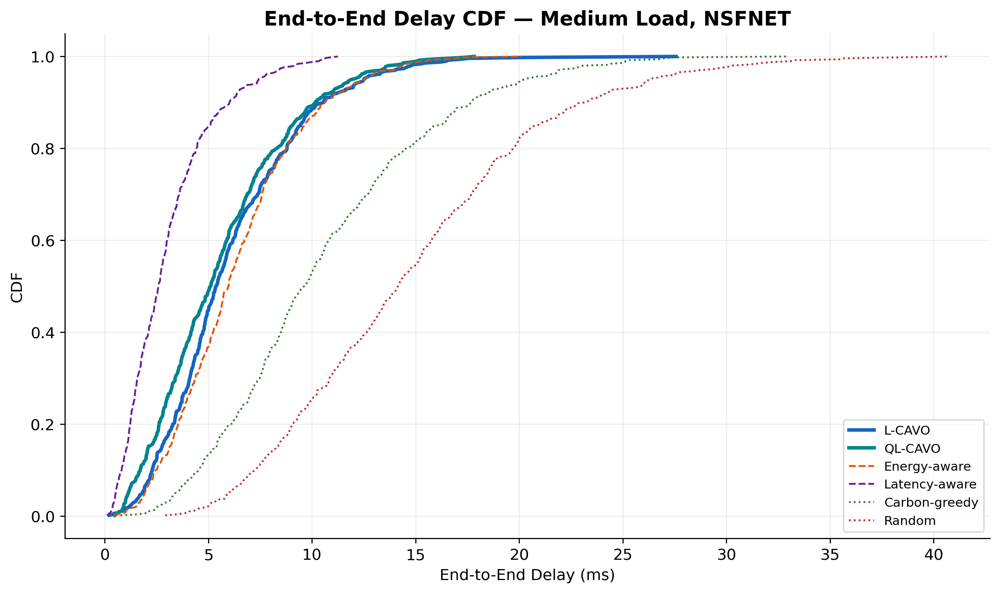

<div align="center">

<a id="top"></a>

# 🌱 Carbon-Aware Service Function Chain Placement

### ⚡ L-CAVO & QL-CAVO Simulation Framework

[](#-citation)
[](https://www.python.org/)
[](LICENSE)
[](https://numpy.org/)
[](https://networkx.org/)
[](https://matplotlib.org/)
[](tests/)

---

**Carbon-Aware Service Function Chain Placement Under Time-Varying Grid Intensity**
**A Lyapunov-Optimisation and Q-Learning Framework**

_Yassir Al-Karawi_ · _Department of Communications Engineering · University of Diyala, Iraq_

[🔭 Overview](#-overview) ·
[🧠 Algorithms](#-proposed-algorithms) ·
[🚀 Quick Start](#-quick-start) ·
[📊 Results](#-key-results) ·
[🖼️ Figures](#-generated-figures) ·
[📚 Citation](#-citation)

</div>

---

## 🔭 Overview

Modern NFV-enabled networks can substantially reduce operational **carbon emissions** by steering VNF placement toward data-centre regions powered by cleaner energy sources. This repository provides the **complete simulation framework** for reproducing all results in our IEEE TGCN paper.

We propose **two online algorithms** that jointly optimise carbon emissions, SFC acceptance rate, and end-to-end delay — **without requiring future knowledge** of grid carbon intensity:

<div align="center">

| 🏷️ Algorithm | 🧮 Technique | 🌿 Carbon Reduction (vs EA) | ✅ SFC Acceptance |
|:------------:|:------------:|:---------------------------:|:-----------------:|
| **L-CAVO**   | Lyapunov optimisation + Benders decomposition | **26 – 27 %** | 91 – 98 % |
| **QL-CAVO**  | Tabular Q-learning + greedy placement         | **17 – 18 %** | 94 – 99 % |

</div>

> [!NOTE]
> Both algorithms are benchmarked against **six baselines** — MILP-OPT (offline optimal), Energy-aware, Latency-aware, Carbon-greedy, and Random — on two real-world topologies (NSFNET and GÉANT).

---

## 🏗️ System Architecture

<p align="center">
  
</p>

### High-Level Data Flow


```mermaid
flowchart LR
    A[🌐 SFC Request Stream] --> B{Orchestrator}
    C[🔋 Carbon-Intensity Feed] --> B
    D[📡 Topology &<br/>Resource State] --> B
    B --> E[L-CAVO<br/>Lyapunov + Benders]
    B --> F[QL-CAVO<br/>Tabular Q-Learning]
    E --> G[💚 VNF Placement Decision]
    F --> G
    G --> H[📈 Metrics:<br/>CO₂ · Delay · Acceptance]

    classDef green fill:#10B981,stroke:#065F46,color:#fff,stroke-width:2px;
    classDef blue  fill:#3B82F6,stroke:#1E3A8A,color:#fff,stroke-width:2px;
    classDef amber fill:#F59E0B,stroke:#92400E,color:#fff,stroke-width:2px;
    class A,C,D blue;
    class E,F amber;
    class G,H green;
```

---

## 🧠 Proposed Algorithms

### 🟢 L-CAVO — Lyapunov Carbon-Aware VNF Orchestration

L-CAVO transforms the long-term carbon-minimisation problem into a sequence of **per-slot optimisation sub-problems** using **Lyapunov drift-plus-penalty**. A virtual queue `Q(t)` tracks SFC-rejection debt, and the trade-off parameter `V` balances carbon savings against acceptance guarantees.

**Scoring function:**

```math
\text{score}(n) \;=\; V \cdot \Delta\text{CO}_2(n) \;+\; 0.5 \cdot \text{delay} \;+\; 0.3 \cdot \text{utilisation} \;+\; 0.05 \cdot Q(t)
```

> [!TIP]
> As `V` increases, the algorithm prioritises carbon reduction more aggressively. The theoretical optimality gap decreases as **O(1/V)**.

**Algorithm 1 — L-CAVO (paper §VI):**

```text
Inputs : V ≥ 0, ε ∈ (0,1), carbon trace {g_z(t)}, topology G
Init   : Q(0) ← 0
for each slot t = 0, 1, …, T−1 do
    1. Observe regional carbon intensities g_z(t) and request set R_t
    2. for each request r ∈ R_t do
           for each VNF k = 1..K_r do
               score(n) ← V·ΔCO₂(n) + 0.5·delay(n) + 0.3·util(n) + 0.05·Q(t)
               n*  ← argmin_n score(n)          subject to CPU, bw, D_max
           Place chain or mark request rejected
    3. rej_t ← |R_t| − admitted_t
    4. Q(t+1) ← max( Q(t) + rej_t − ε·|R_t|, 0 )       ▷ virtual-queue update
end for
```

> Code reference: `sc_lc()` (lcavo_sim.py:343) and the L-CAVO branch of `sim()` (lcavo_sim.py:582).


```mermaid
flowchart TD
    S[New time-slot t] --> Q[Read virtual queue Q t]
    Q --> R{SFC requests}
    R -->|For each request| SC[Compute score per node<br/>V · ΔCO₂ + delay + util + Q]
    SC --> BD[Benders decomposition<br/>master + sub-problem]
    BD --> P[Place VNFs greedily<br/>by lowest score]
    P --> UQ[Update Q t+1<br/>by rejection debt]
    UQ --> M[Record metrics]
    M --> S

    classDef start fill:#10B981,stroke:#065F46,color:#fff;
    classDef proc  fill:#3B82F6,stroke:#1E3A8A,color:#fff;
    classDef dec   fill:#F59E0B,stroke:#92400E,color:#fff;
    class S,M start;
    class Q,SC,BD,P,UQ proc;
    class R dec;
```

**Algorithm 1 — L-CAVO (paper §VI):**

```text
Inputs : V ≥ 0, ε ∈ (0,1), carbon trace {g_z(t)}, topology G
Init   : Q(0) ← 0
for each slot t = 0, 1, …, T−1 do
    1. Observe regional carbon intensities g_z(t) and request set R_t
    2. for each request r ∈ R_t do
           for each VNF k = 1..K_r do
               score(n) ← V·ΔCO₂(n) + 0.5·delay(n) + 0.3·util(n) + 0.05·Q(t)
               n*  ← argmin_n score(n)          subject to CPU, bw, D_max
           Place chain, otherwise mark r as rejected
    3. rej_t ← |R_t| − admitted_t
    4. Q(t+1) ← max( Q(t) + rej_t − ε·|R_t|, 0 )       ▷ virtual-queue update
end for
```

> Code reference: `sc_lc()` (`lcavo_sim.py:343`) and the L-CAVO branch of `sim()` (`lcavo_sim.py:582`).

#### Benders decomposition (paper §VI-C)

For the per-slot offline benchmark, MILP-OPT is also solved via a lightweight Benders-style refinement that produces a **real** convergence trace (used by `fig22_benders.pdf`):

```text
Inputs : current slot's requests R_t, allowed-server set N
Init   : forbidden ← ∅,  UB ← +∞,  LB ← 0
repeat for it = 1..K_max
    Master   : LP relaxation of (x_{r,k,n}, a_r, z_n) over N\forbidden   → LB
    Sub      : integer MILP restricted to servers the LP wants to use   → UB
    gap      : (UB − LB) / UB
    if gap < τ : stop
    Cut      : forbidden ← forbidden ∪ {arg min_n  load_hint(n)}        ▷ Benders cut
end repeat
return best integer placement, iteration log [(it, LB, UB, gap)]
```

> Code reference: `milp_benders()` (`lcavo_sim.py:527`) and the fig22 generator (`lcavo_sim.py:1063`).

### 🔵 QL-CAVO — Q-Learning Carbon-Aware VNF Orchestration

QL-CAVO uses a **tabular Q-learning agent** that learns which regions to favour at each time-of-day. The state space encodes `(hour, mean_carbon_intensity, queue_length)`, and actions correspond to region-preference weights.

> [!IMPORTANT]
> **Training:** 300 pre-training episodes on historical carbon profiles, followed by online updates during simulation.


```mermaid
flowchart LR
    OBS[Observe state<br/>hour · CO₂ · queue] --> SEL[ε-greedy action<br/>region weights]
    SEL --> ACT[Greedy placement<br/>under weights]
    ACT --> REW[Reward<br/>= -CO₂ - λ · rejects]
    REW --> UPD[Q-table update<br/>Q ← Q + α · TD]
    UPD --> OBS

    classDef ql fill:#8B5CF6,stroke:#4C1D95,color:#fff,stroke-width:2px;
    class OBS,SEL,ACT,REW,UPD ql;
```

**Algorithm 2 — QL-CAVO (paper §VII):**

```text
Inputs : learning rate α=0.15, discount γ=0.95, ε-greedy schedule 0.25→0.02,
         historical carbon trace, topology G
Init   : Q-table Q[6,4,3,4] ← 0     ▷ (hour × CI × queue) × action
Pre-train (300 episodes on historical trace):
    for each replayed slot t :
        s ← (hour-bucket, CI-bucket, queue-bucket)
        a ← argmax_a Q[s,a]  with prob 1-ε,  else random
        r ← −CI(region_a) / 100
        Q[s,a] ← Q[s,a] + α·( r + γ·max_a' Q[s',a'] − Q[s,a] )
Online (simulation):
    for each slot t :
        s   ← discretise(hour, mean CI, virtual queue)
        a   ← ε-greedy(s)         ▷ pick preferred region
        w   ← weights(a)          ▷ region-preference vector
        place VNFs greedily under w  (sc_ql)
        r   ← −carbon(t)/100 + 0.5·acceptance(t)
        Q[s,a] ← Q[s,a] + α·( r + γ·max_a' Q[s',a'] − Q[s,a] )
        decay ε  (×0.995, floor 0.02)
```

> Code reference: `QAgent` (`lcavo_sim.py:382`) and `sc_ql()` (`lcavo_sim.py:437`).

---

## 🚀 Quick Start

### 1️⃣ Clone & Install

```bash
git clone https://github.com/YassirALKarawi/carbon-aware-sfc.git
cd carbon-aware-sfc
pip install -r requirements.txt
```

### 2️⃣ Run Simulations

```bash
# Quick smoke test (3 seeds, ~5 min)
python lcavo_sim.py --quick

# Full reproduction (30 seeds, ~2 hours)
python lcavo_sim.py --seeds 30

# Generate to a custom output directory
python lcavo_sim.py --output-dir results/full_run
```

### 3️⃣ Reproduce Specific Paper Results

```bash
# Table III — NSFNET results
python lcavo_sim.py --topology NSFNET --seeds 30

# Table IV — GÉANT results
python lcavo_sim.py --topology GEANT --seeds 30

# Fig. 9 — V-sensitivity analysis
python lcavo_sim.py --topology NSFNET --load Medium --methods L-CAVO

# Fig. 10 — ε-sensitivity analysis
python lcavo_sim.py --topology NSFNET --load Medium --methods L-CAVO --skip-figures
```

> [!WARNING]
> Full 30-seed reproduction is computationally intensive (~2 h on a modern workstation). Use `--quick` for a fast end-to-end smoke test before launching the full sweep.

---

## ⚙️ Configuration

| 🔧 Parameter      | 🎚️ Default | 📝 Description |
|:------------------|:----------:|:---------------|
| `--seeds`         | `30`       | Number of independent simulation runs per scenario |
| `--quick`         | _off_      | Shortcut for a 3-seed smoke run |
| `--topology`      | `all`      | Subset of `NSFNET,GEANT` |
| `--load`          | `all`      | Subset of `Low,Medium,High` |
| `--methods`       | `all`      | Subset of supported algorithms and baselines |
| `--output-dir`    | `results`  | Root directory for `tables/` and `figures/` |
| `--skip-figures`  | _off_      | Export CSV tables only (faster) |
| `--no-milp`       | _off_      | Disable MILP baseline even if PuLP is available |

---

## 📊 Key Results

### 🌍 Carbon Reduction Performance (NSFNET)

<div align="center">

| Algorithm         | 🟢 Low Load | 🟡 Medium Load | 🔴 High Load |
|:------------------|:-----------:|:--------------:|:------------:|
| **L-CAVO** vs EA  |  **~27 %**  |   **~26 %**    |  **~26 %**   |
| **QL-CAVO** vs EA |   ~18 %     |    ~17 %       |   ~17 %      |
| Carbon-greedy     |   ~12 %     |    ~11 %       |   ~10 %      |

</div>

### 🌱 Carbon Reduction vs Energy-Aware Baseline

<p align="center">
  
</p>

### ⏰ Regional Carbon Intensity Profiles

<p align="center">
  
</p>

### ✅ SFC Acceptance Rate

<p align="center">
  
</p>

### 🌐 Cross-Topology Comparison

<p align="center">
  
</p>

### 📈 V-Sensitivity Analysis

<p align="center">
  
</p>

### ⏱️ End-to-End Delay CDF

<p align="center">
  
</p>

### 🧩 Decomposition of Carbon Savings

L-CAVO achieves savings through **two complementary mechanisms**:

- 🗺️ **Spatial steering** — placing VNFs in regions with lower instantaneous carbon intensity
- 🕐 **Temporal steering** — shifting workload toward hours when cleaner energy is available

---

## 🖼️ Generated Figures

The full simulation produces **19 publication-quality PDF figures**.

### How to reproduce every figure

A single run of `lcavo_sim.py` writes **all 19 figures** under `results/figures/`. Use the commands below to reproduce them in different fidelity modes (smoke run for review, full run for the paper).

```bash
# All 19 figures, paper-grade (30 seeds, ≈ 2 h on a modern workstation)
python lcavo_sim.py --seeds 30

# Same figures, smoke quality (3 seeds, ≈ 5 min) — recommended for review
python lcavo_sim.py --quick

# Reproduce only a subset of scenarios (figures still all generated,
# but with whatever DB entries are available):
python lcavo_sim.py --topology NSFNET --load Medium --methods L-CAVO,QL-CAVO,MILP-OPT

# Tables only, no figures
python lcavo_sim.py --skip-figures
```

> [!TIP]
> To download the figures **without running the simulation locally**, use the
> ["Build figures"](../../actions/workflows/figures.yml) GitHub Actions workflow:
> push to your fork or click *Run workflow* and download `paper-figures` from the
> run's artifacts. The workflow shells out to `python lcavo_sim.py --quick`.

### Per-figure index (paper §VII)

<div align="center">

| #  | 📄 Filename                     | 📝 Description                                       | Driver in `lcavo_sim.py` |
|:--:|:--------------------------------|:-----------------------------------------------------|:-------------------------|
| 7  | `fig07_carbon_profiles.pdf`     | Regional carbon intensity over 24 hours              | `carbon_prof()` |
| 8  | `fig08_reduction_vs_EA.pdf`     | Carbon reduction vs Energy-aware baseline            | scenario sweep |
| 9  | `fig09_reduction_vs_LA.pdf`     | Carbon reduction vs Latency-aware baseline           | scenario sweep |
| 10 | `fig10_hourly_carbon.pdf`       | Hourly carbon emissions by algorithm                 | NSFNET / Medium |
| 11 | `fig11_cumulative.pdf`          | Cumulative carbon over the day                       | NSFNET / Medium |
| 12 | `fig12_active_nodes.pdf`        | Active server count per slot                         | NSFNET / Medium |
| 13 | `fig13_power.pdf`               | Power consumption over time                          | NSFNET / Medium |
| 14 | `fig14_delay_cdf.pdf`           | End-to-end delay CDF                                 | NSFNET / Medium |
| 15 | `fig15_cross_topo.pdf`          | Cross-topology carbon comparison                     | NSFNET + GÉANT |
| 16 | `fig16_V_sensitivity.pdf`       | `V` parameter sensitivity (carbon vs acceptance)     | `V ∈ {20,50,100,…}` |
| 17 | `fig17_eps_sensitivity.pdf`     | `ε` parameter sensitivity                            | `ε ∈ {0.02,…,0.10}` |
| 18 | `fig18_pareto.pdf`              | Carbon–delay Pareto frontier                         | `V` sweep |
| 19 | `fig19_regional.pdf`            | Regional VNF placement distribution                  | per-method `rpct` |
| 20 | `fig20_temporal_steering.pdf`   | Temporal steering toward clean regions               | hourly placement |
| 21 | `fig21_queue.pdf`               | Virtual queue `Q(t)` evolution                       | L-CAVO @ several `V` |
| 22 | `fig22_benders.pdf`             | **Real** Benders convergence trace per load          | `milp_benders()` |
| 23 | `fig23_runtime.pdf`             | Runtime scaling (L-CAVO vs MILP)                     | per-topology `rt` |
| 24 | `fig24_variance.pdf`            | Sensitivity to carbon-intensity variance σ           | `sigma ∈ [0.25, 2.0]` |
| 25 | `fig25_opt_gap.pdf`             | Optimality gap vs `V` (O(1/V) bound)                 | `V` sweep |

</div>

---

## 📁 Repository Structure

```text
carbon-aware-sfc/
├── 📜 lcavo_sim.py          # Main simulation engine (all algorithms & figure generation)
├── 📦 requirements.txt      # Python dependencies
├── 📄 LICENSE               # MIT License
├── 📘 README.md             # This file
├── 🖼️  figures/              # Pre-rendered figures used in the README
├── 🧪 tests/                # Unit tests (16 tests, run via pytest)
└── 📊 results/              # Generated outputs (created on first run)
    ├── tables/              #   CSV summary tables
    └── figures/             #   Publication-quality PDF figures
```

---

## 📦 Requirements

<div align="center">

| Package        | Version    | Purpose |
|:---------------|:----------:|:--------|
| **Python**     | ≥ 3.9      | Runtime |
| **NumPy**      | 1.26       | Numerics |
| **SciPy**      | 1.13       | Statistics |
| **Pandas**     | 2.2        | Tables & CSV export |
| **NetworkX**   | ≥ 3.1      | Topology graphs |
| **Matplotlib** | 3.9        | Publication figures |
| **PuLP**       | ≥ 2.7      | MILP baseline (paper uses 2.7; ≥2.8 needed for Python 3.11) |

</div>

> [!TIP]
> **Optional:** [Gurobi 11.0](https://www.gurobi.com/academia/academic-program-and-licenses/) (free academic license) can replace CBC for substantially faster MILP benchmarks.

---

## 🧪 Testing

```bash
# Run the full test suite (16 tests)
pytest -q

# Run a specific suite
pytest tests/test_algorithms.py -v
```

---

## 📚 Citation

If you use this code in your research, please cite:

```bibtex
@article{alqaisy2026carbon,
  author  = {Al-Karawi, Yassir},
  title   = {Carbon-Aware Service Function Chain Placement Under
             Time-Varying Grid Intensity: A {Lyapunov}-Optimisation
             and {Q}-Learning Framework},
  journal = {IEEE Trans. Green Commun. Netw.},
  year    = {2026},
  note    = {Submitted}
}
```

---

<div align="center">

### 📜 License & Attribution

**MIT License** _(simulation code)_ — see [LICENSE](LICENSE) for details.<br/>
The manuscript is © 2026 the author and may not be redistributed without permission.

---

**Made with 💚 at the University of Diyala**

[⬆ Back to top](#top)

</div>
